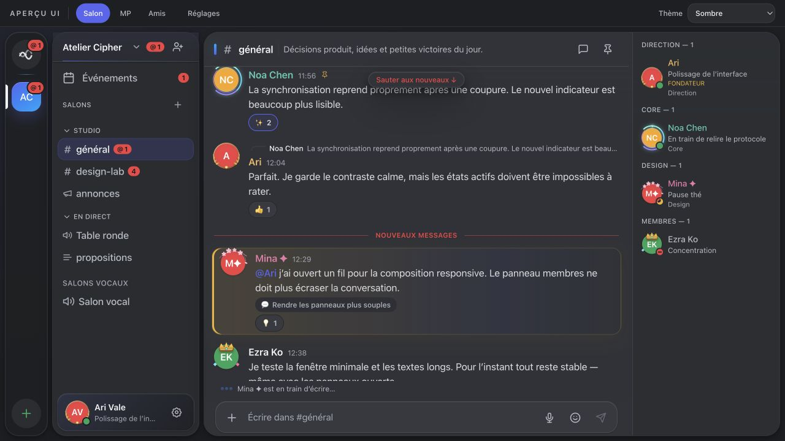
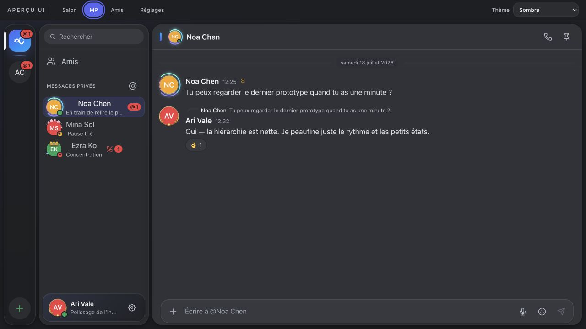
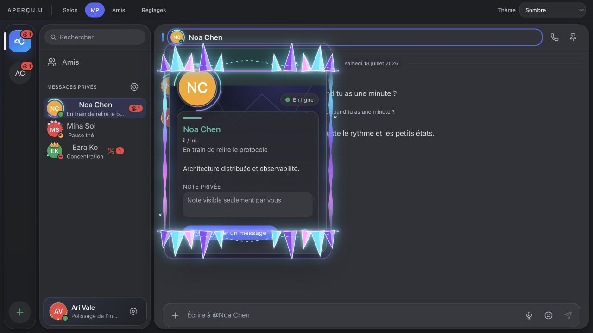
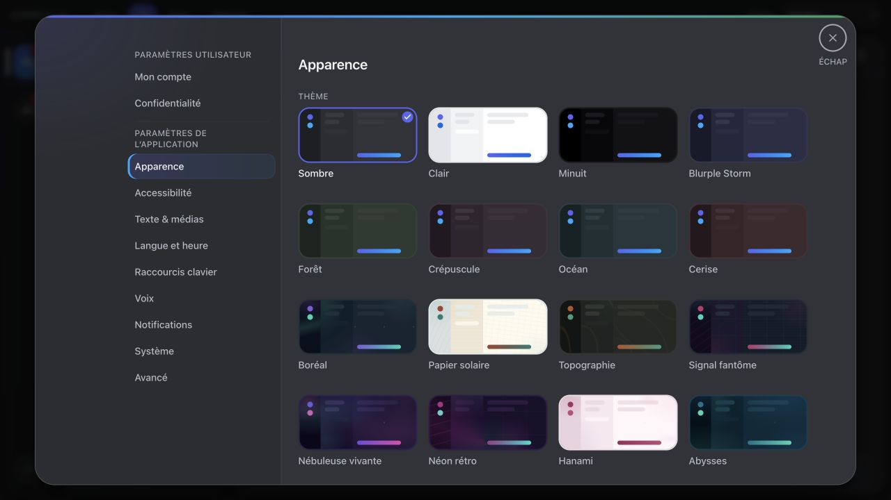

<p align="center">
  
</p>

<h1 align="center">Accord</h1>

<p align="center">
  <b>A Discord-like desktop app — peer-to-peer, end-to-end encrypted, no server.</b>
</p>

<p align="center">
  <a href="https://github.com/Gomouu/accord/releases/latest"></a>
  <a href="https://github.com/Gomouu/accord/actions/workflows/ci.yml"></a>
  
  <a href="LICENSE"></a>
</p>

<p align="center">
  
</p>

Accord looks and feels like Discord — friends, DMs, servers, voice — but there
is **no server behind it**. Messages travel **directly between the apps**,
end-to-end encrypted. Nobody can host, read, sell, or lose your conversations.

## How it works

- 🌐 **No central server** — peers find each other through a Kademlia DHT and
  connect directly (automatic NAT hole punching, relay as last resort). Nothing
  to self-host, no account on anyone's machine but yours.
- 🔐 **End-to-end encrypted, at rest too** — XChaCha20-Poly1305 on the wire,
  SQLCipher on disk, unlocked by your passphrase.
- 🗝️ **Your identity is 12 words** — no email, no phone number. The recovery
  phrase restores your account on any machine; lose it and nobody can.
- 📬 **Offline friends still get your messages** — they are dropped into
  encrypted mailboxes on the DHT and delivered when they come back (up to
  7 days).

> Accord protects the **content** of your exchanges, not your **anonymity** —
> peers see your IP, like most P2P software. Guarantees and limits:
> [SECURITY.md](SECURITY.md).

## Features

| | |
|---|---|
| 💬 **Chat** | DMs and servers — text, announcement and forum channels, threads, categories, pins, mentions, reactions, custom emojis, stickers, polls, file sharing with image thumbnails |
| 📞 **Voice** | Voice channels and 1-to-1 calls with ringing, noise suppression (RNNoise), auto gain, packet-loss recovery (Opus FEC), soundboard |
| 🛡️ **Communities** | Roles & permissions, moderation (kick/ban/timeout), AutoMod word filter, invitations, scheduled events, server folders |
| ⌨️ **Comfort** | Ctrl/Cmd+K palette (navigation + commands), right-click menus everywhere, dock unread badge, native notifications, keyboard shortcuts, built-in signed updates |
| 🎨 **Personalization** | 24 themes (light & dark, 5 animated figurative scenes), animated profile decorations, effects and frames, custom status, message density |
| 👥 **Accounts** | Multi-account, encrypted full backup (`.accordbackup`), English & French |

## Screenshots

<table>
  <tr>
    <td width="33%" valign="top">
      <br/>
      <sub><b>Direct messages</b> — one-to-one, end-to-end encrypted</sub>
    </td>
    <td width="33%" valign="top">
      <br/>
      <sub><b>Profile personalization</b> — animated frames, effects and decorations</sub>
    </td>
    <td width="33%" valign="top">
      <br/>
      <sub><b>Appearance</b> — 24 themes, light &amp; dark</sub>
    </td>
  </tr>
</table>

## Install

Download from the **[latest release](https://github.com/Gomouu/accord/releases/latest)**:

| System | File | First-launch note |
|--------|------|-------------------|
| **macOS** (Apple Silicon) | `Accord_*_aarch64.dmg` | macOS says the app is "damaged" because it is **not notarized** (paid Apple certificate). Fix once: `xattr -cr /Applications/Accord.app` |
| **Windows** | `Accord_*_x64-setup.exe` | SmartScreen warning (not code-signed): **More info → Run anyway** |
| **Linux** | `.deb` / `.AppImage` / `.rpm` | `sudo apt install ./Accord_*.deb`, etc. |

Installing is a one-time step: from 2.0.0 onward Accord **updates itself** —
it checks for new versions, tells you, and installs in one click (signed,
verified artifacts).

## Quick start

1. **Create your account** — pick a passphrase, then **write down the 12-word
   recovery phrase**. It is shown only once and it is the *only* way to restore
   your account on another machine.
2. **Add a friend** — share your friend link or QR code (Friends → Add a
   friend), or exchange friend codes (`WORD-WORD-WORD-1234`). Both sides
   confirm.
3. **Talk** — create a server and invite friends, or just chat, call and share
   files from a DM.

<details>
<summary><b>Build from source</b></summary>

Requirements: [Rust](https://rustup.rs) ≥ 1.85, [Node.js](https://nodejs.org) ≥ 20,
libopus + pkg-config (`brew install opus pkgconf` on macOS,
`sudo apt install libopus-dev` + the [Tauri prerequisites](https://tauri.app/start/prerequisites/) on Linux).

```sh
git clone https://github.com/Gomouu/accord && cd accord/app
npm ci
npm run tauri dev     # development
npm run tauri build   # installable app
```

First build takes several minutes (bundled SQLCipher and OpenSSL).

</details>

## Project status

Actively developed — see the [changelog](CHANGELOG.md) and
[releases](https://github.com/Gomouu/accord/releases). The peer-to-peer core
has been through repeated internal adversarial security audits, but **no
external audit yet** — treat it accordingly for high-stakes use.

## Documentation

| Document | Contents |
|----------|----------|
| [SECURITY.md](SECURITY.md) | Threat model — guarantees and limits |
| [docs/THREAT-MODEL.md](docs/THREAT-MODEL.md) | Accepted trade-offs, in depth |
| [docs/ARCHITECTURE.md](docs/ARCHITECTURE.md) | Layer architecture |
| [docs/SPEC.md](docs/SPEC.md) | Wire protocol |
| [docs/API.md](docs/API.md) | UI ↔ node API |
| [docs/DEV.md](docs/DEV.md) | Developer guide |

## Authenticity & disclaimer

https://github.com/Gomouu/accord is the **only** official source of Accord —
don't trust copies found elsewhere. Accord is provided "as is", without
warranty; you are solely responsible for your use of it.

## License

[MIT](LICENSE) — © 2026 the Accord contributors.
